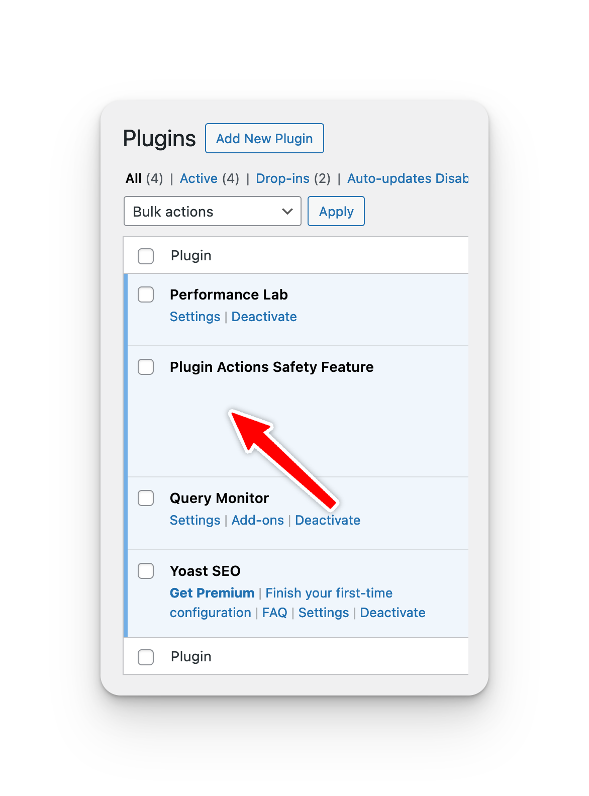
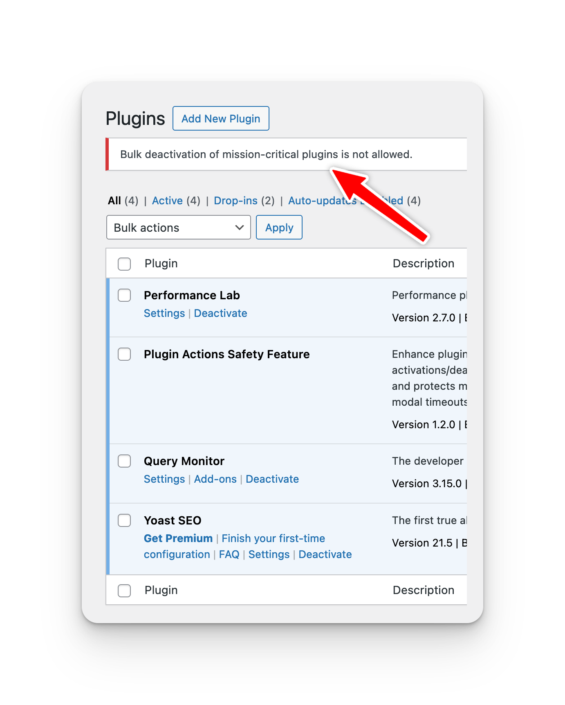
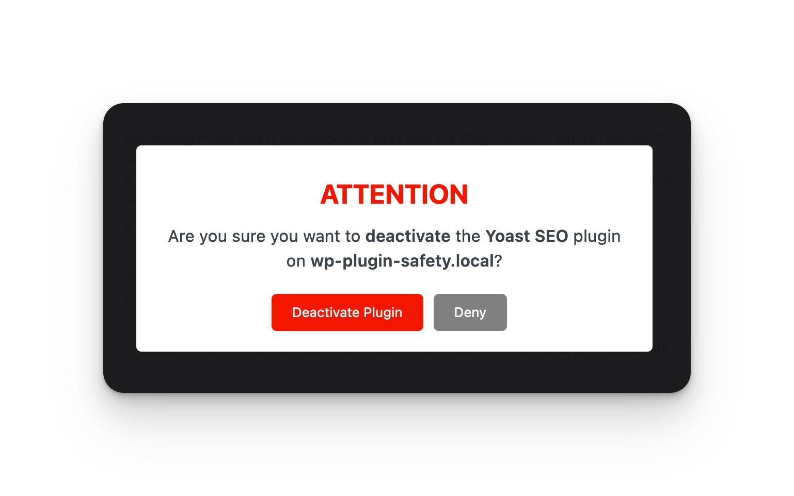
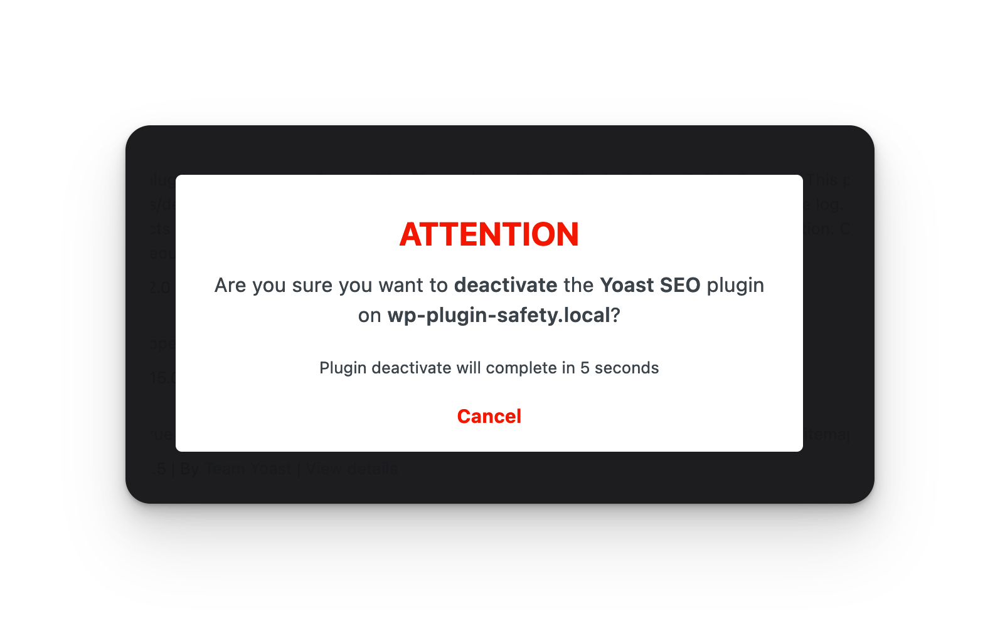
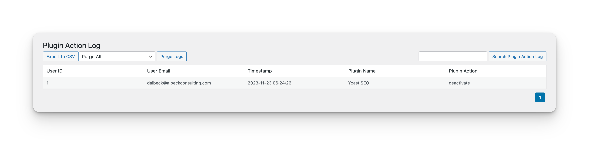
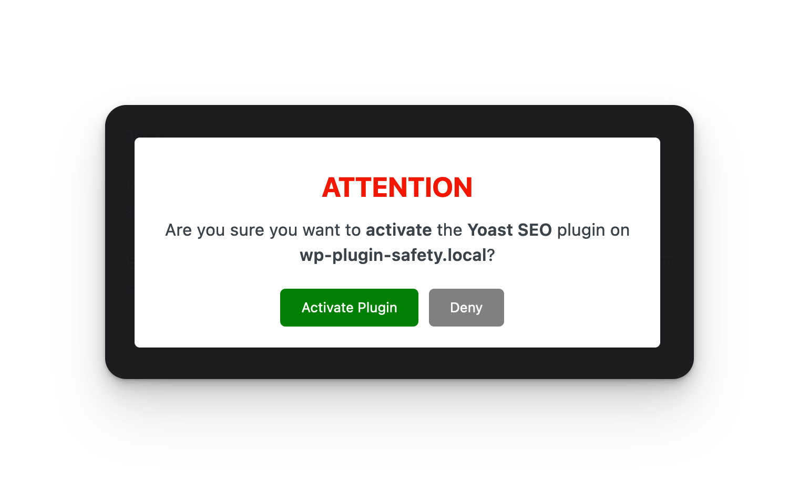
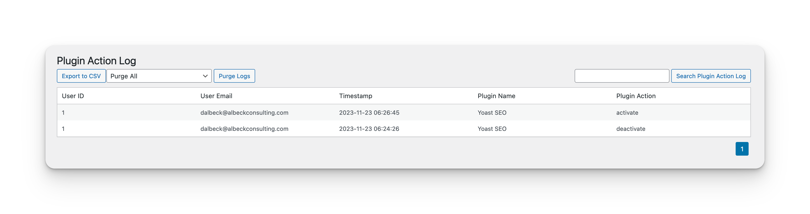

# Actions Safety Feature
Contributors: dalbeck\
Tested: 6.4.1\
Stable tag: 1.2.3\
License: GPLv3 or later\
License URI: https://www.gnu.org/licenses/gpl-3.0.en.html

This is a WordPress plugin that introduces a warning modal for critical plugin activations/deactivations, logs these actions for accountability, and supports CSV exports of the log. It also includes a purging feature for log management and protects mission-critical plugins from accidental deactivation, including bulk action prevention. Optionally extendable for custom purge timelines and modal timeouts.

## Features
- **Warning Modal**: Prevents accidental activation/deactivation with a confirmation modal, and a timer (defaults to 10 seconds) before action fires.
- **Action Logging**: Records plugin activations/deactivations in a custom database table.
- **CSV Export**: Export the log of plugin actions to a CSV file.
- **Log Purge:** Ability to purge database log to prevent bloat over time.
- **Log Search:** Ability to search the log by user ID, user email, plugin name and plugin action.
- **Critical Plugin Protection**: Disables deactivation links for specified essential plugins, and also prevent workaround of bulk actions.
- **Extensibility**: Offers hooks to modify modal timeout, disable modal timeout, set critical plugin list, and modify pagination of action log.

## Usage

- Works upon activation. Critical plugin deactivation links are disabled.
- Confirmation modal appears for any plugin activation/deactivation.
- View the plugin actions log under 'Plugins > Plugin Action Log' in the dashboard.
- Export the log using the 'Export to CSV' button on the Plugin Action Log page.

## Customizations
The following customizations can be made by adding the appropriate filter to your theme's `functions.php` file.

### Adjust Modal Timeout

```php
add_filter('dawp_modal_timeout', function($timeout) {
    return 15000; // New timeout in milliseconds
});
```

### Disable Modal Timer
```php
add_filter('dawp_disable_modal_timer', '__return_true');
```

### Adjust Action Log Pagination
```php
add_filter('dawp_log_pagination_count', function($count) {
    return 20; // New items per page count
});
```
### Adjust Critical Plugins list
```php
function my_custom_critical_plugins($critical_plugins) {
    $critical_plugins[] = 'my-custom-plugin/my-custom-plugin.php'; // Add a plugin
    if (($key = array_search('gravityforms/gravityforms.php', $critical_plugins)) !== false) {
        unset($critical_plugins[$key]); // Remove a plugin
    }
    return $critical_plugins;
}
add_filter('da_mission_critical_plugins', 'my_custom_critical_plugins');
```
## Screenshots

#### Mission Critical Plugin


#### Bulk Actions Error


#### Deactivate Plugin Modal Warning


#### Deactivate Plugin Modal Countdown


#### Plugin Action Log


#### Activate Plugin Modal


#### Plugin Action Log Multiple Records

## Optimizations

All scripts are programmed to only load on the `plugins.php` and `/wp-admin/plugins.php?page=plugin-action-log` screens within WP Admin Dashboard. The database table created for the plugin is indexed, and all queries will only execute when necessary between these two URLs. On plugin deletion, all data created by the plugin will be removed from the database.


## Support

For support please use the GitHub Discussions feature, if there is a bug, please open an issue in the repository. Feature requests are welcome, but not guarenteed.
